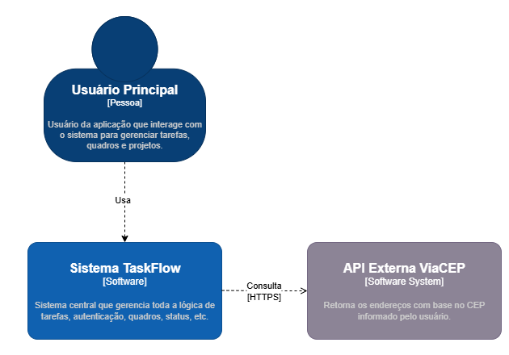
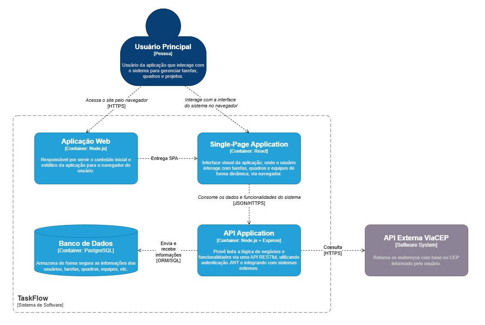
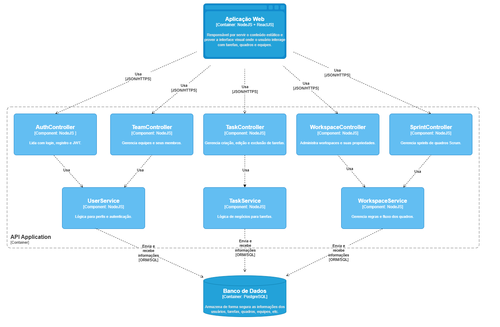
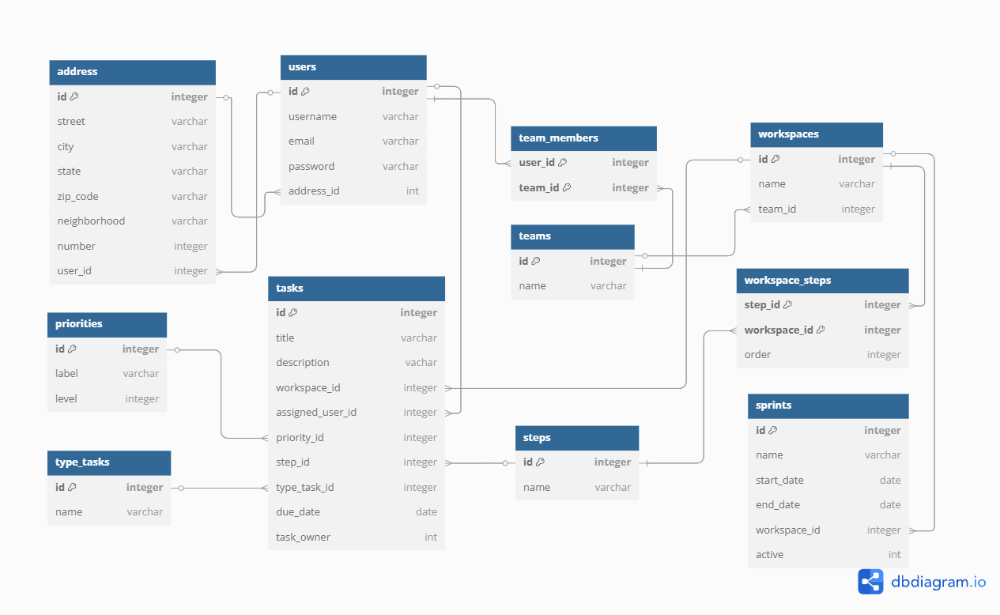

# Modelo C4

## 🧭 Contexto

O TaskFlow é uma aplicação de gerenciamento de tarefas e projetos voltada para equipes que desejam mais organização e produtividade. O sistema permite que os usuários criem quadros, definam sprints, atribuam responsabilidades e acompanhem o progresso de atividades de forma colaborativa. Abaixo, o diagrama mostra como o sistema se integra com usuários e sistemas externos.

---

## 🧱 Contêineres

A arquitetura do TaskFlow é composta por diversos contêineres, cada um com uma responsabilidade específica, organizados de forma escalável e modular. O diagrama a seguir detalha como o sistema está dividido entre front-end, API, banco de dados e integrações externas.

---

## 🧩 Componentes

Este nível detalhará os principais módulos internos da aplicação, como: autenticação, gestão de tarefas, quadros e equipes.

---

## 🧑‍💻 Código

Este nível demonstrará a estrutura do código-fonte, organizado por módulos e camadas, seguindo o padrão MVC e boas práticas de separação de responsabilidades.

