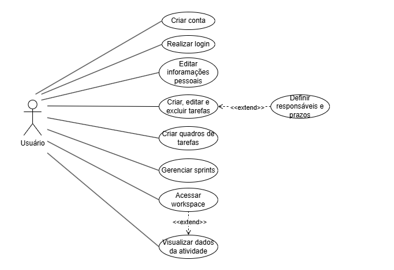

# Casos de Uso

## 🎭 Atores

1. **Usuário**: Pessoa logada no sistema.
2. **Sistema**: Executa automaticamente validações de regras de negócio e dados.

---

## ✅ Casos de Uso

### 1. Criar conta
- **Ator Principal**: Usuário  
- **Descrição**: Permite que o usuário crie uma conta no sistema.  

---

### 2. Realizar login
- **Ator Principal**: Usuário  
- **Descrição**: Permite que o usuário acesse sua conta.  
- **Inclui**: Validar dados (`Sistema`)

---

### 3. Editar informações pessoais
- **Ator Principal**: Usuário  
- **Descrição**: Permite editar dados pessoais como nome, e-mail ou senha.  
- **Inclui**: Validar dados (`Sistema`)

---

### 4. Criar, editar e excluir tarefas
- **Ator Principal**: Usuário  
- **Descrição**: Permite o gerenciamento completo de tarefas.  
- **Estende**: Definir responsáveis e prazos (`Sistema`)

---

### 5. Criar quadros de tarefas
- **Ator Principal**: Usuário  
- **Descrição**: Permite criar quadros no formato Kanban ou Scrum.  
- **Inclui**: Configurar propriedades iniciais (`Sistema`)

---

### 6. Gerenciar sprints
- **Ator Principal**: Usuário  
- **Descrição**: Permite o gerenciamento de sprints quando o quadro for Scrum.  
- **Inclui**: Validar se o quadro é Scrum (`Sistema`)

---

### 7. Acessar workspace
- **Ator Principal**: Usuário  
- **Descrição**: Permite acessar workspaces dos quais o usuário faz parte.  
- **Inclui**: Validar se o usuário está incluído como membro da equipe (`Sistema`)

---

### 8. Visualizar dados da atividade
- **Ator Principal**: Usuário  
- **Descrição**: Permite visualizar informações detalhadas de uma tarefa ou atividade.

---

## 📈 Diagrama UML

